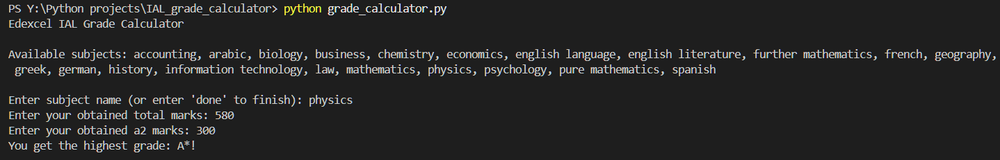

# Edexcel IAL Grade Calculator

A simple Python script to calculate grades for Edexcel International A Level (IAL) subjects.  
It applies the official A* rule: students must achieve **≥80% overall** and **≥90% in A2 units** to earn an A*.

---

## 🔧 Prerequisites
- Python 3.x installed on your system.
- No external modules required (only built‑in Python functions are used).
- Optional: create a `requirements.txt` (not strictly needed here since no extra packages are used).

---

## 🚀 How to Run the Script
1. Clone or download this repository.
2. Navigate to the project folder:
   ```bash
   cd "Y:\Python projects\grade_calculator"

## 📸 Screenshot/GIF showing the sample use of the script


## Author Name
